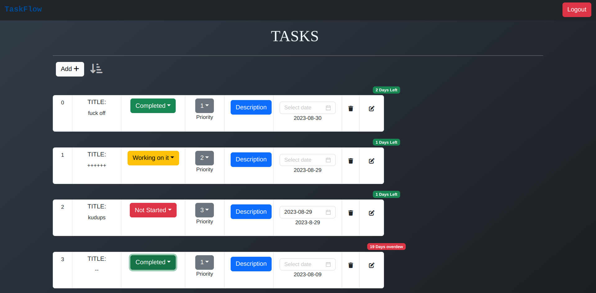

# TaskFlow

## Overview:
My website will help you to effortlessly organize and monitor your tasks, ensuring optimal productivity and timely completion with a friendly-user interface.The website dynamically calculates and displays the remaining days until each task's completion, offering you a clear perspective on your workload.You can alter the task list to your preferences by sorting entries according to your specific needs(even by drag and drop), enabling you to prioritize efficiently. You can add, delete, and update the status of the tasks as they evolve.

## Motivation:
Introducing a transformative work management website that optimizes team collaboration and productivity. This platform offers intuitive tools for seamless task tracking, efficient project management, and organized time utilization. It fosters teamwork through real-time communication and feedback, enhancing project outcomes. Data-driven insights and personalized features empower informed decision-making and cater to individual team needs. Revolutionize your workflows with this all-in-one solution for enhanced work management.

## Implementation:
The frontend is built using React and CSS, while the backend is built using Node, Express, and MongoDB Atlas. I used the entire MERN Stack, even though I didn't have much knowledge when I started the project.  

I had very little to no knowledge about web-devolpment and how websites worked. I started by learning HTML and CSS from [FreeCodeCamp.org](https://www.youtube.com/c/Freecodecamp). I then learnt JavaScript and built a very basic static website using HTML, CSS and JS while following along with tutorials by [CodeWithHarry](https://www.youtube.com/@CodeWithHarry). I then learnt React, how to use react hooks, React router, and finsihed the basic UI structure of the site. The react documentation is very well written. I then watched [Traversy media](https://www.youtube.com/channel/UC29ju8bIPH5as8OGnQzwJyA) on how to use APIs and use fetchAPI call from JS, await, async and integrated them. I also used some React libraries like 'react-beautiful-dnd', 'react-type-animation'. I then came to know about responsive websites and made my website mobile friendly. I have styled everything including animations(except the typing animation, which I tried and realized there is a react library for it) in plain CSS, without using any framework. I then felt the need for a backend so that users can add specific exercises to favourites and access them later. I learned node and building apis using express from [Traversy media](https://www.youtube.com/channel/UC29ju8bIPH5as8OGnQzwJyA). I used MongoDB atlas to store user info and slots. I learnt about Json web token to store login state also.

## Technologies/libraries used
* React
* MongoDB
* Express
* NodeJS
* mongooose
* JSON web token
* Rapid API
* react-beautiful-dnd
* react-router-dom
* react-top-loading-bar

## Experience:
I enjoyed building this site as it was my first completely self-built website from scratch. I faced issue in useEffect as it was not rendering when required. Later i found out the issue and solved it. I also had a tough time in drag and drop but some how managed to pull it off. Overall i learnt a lot of new things and I hope I can improve and make better websites.

## Future scope

* As I ran into problems while hosting the website, I want to solve all those issues and host it and also make it optimized for search engines (Search engine optimiziation SEO) .
* I plan on adding file uploads as imp files can be accessed immediately.
* I also plan on making the UI better as I feel it is not up to the mark.
* I also want to figure out a way to make the website available offine, where users can download exercises.